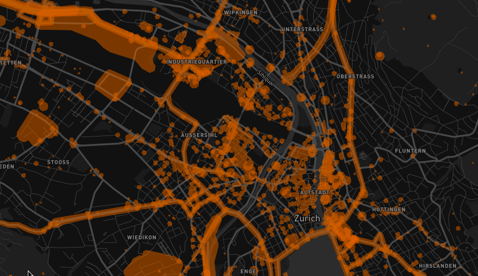

# osm-noise-pollution

Approximate global noise pollution with OSM data and very simple noise model.
Using global street, landuse and building data from [OpenStreetMap](https://openstreetmap.org)
we can approximate where noise pollution might happen.
We use a very simple noise model inspired by [noise pollution concept of Cities Skylines](http://www.skylineswiki.com/Pollution#Noise_pollution).

In the model we add a buffer to **noisy objects**. This is the area that is probably affected by noise. Very noisy objects get a high buffer and less noisy objects a smaller buffer.

In order for this to work we make several assumptions:

1. Highways, trunks, primary and secondary roads are noisy. Normal street or service roads are not
2. Retail and industrial zones always have a noisy base limit
3. All shops and food places (especially restaurants) are noisy
4. Most party and event buildings are noisy (except some shady places)
5. Most leisure buildings are noisy
6. Some sport buildings are noisy
7. Some tourism buildings are noisy

For OSM features that match this criterias we assign a buffer and remove the overlapping parts which results
in a simple approximation of noise pollution.



## Develop

We use the Docker Compose based workflow we developed at [osm2vectortiles](https://github.com/osm2vectortiles/osm2vectortiles) to create an ETL workflow to get data in and out of PostGIS.

### Get Started

You need a complete OSM PBF data dump either from a [country extract](http://download.geofabrik.de/index.html) or of the [entire world](http://planet.osm.org/).

In this example we will work with my beloved Switzerland. Download the data and put it into the `data` directory.

```bash
wget --directory-prefix=./data http://download.geofabrik.de/europe/switzerland-latest.osm.pbf
```

Now we need to set up the database and import the data using the `import-osm` Docker container.

```bash
# This will automatically initialize the database
docker-compose up -d postgres

# Import the OSM data dump from the ./data folder
docker-compose run import-osm
```

We can now export vector tiles containing the noise pollution geometries ready to
use for map visualizations with Mapnik or Mapbox GL.
If you want to change the export bounding box from Switzerland to a different
country you need to modify the `BBOX` env var in `docker-compose.yml`
for the `export-vectortiles` container.

```bash
docker-compose run export-vectortiles
```

And now we have all the data and code in place.
Let's look at it visually. Start Mapbox Studio and visit the port `3000` on your
Docker host.

```bash
docker-compose up mapbox-studio
```

Login and open the source project via `Browse` mounted at `/projects`. You should see `vector-datasource.tm2source`.
Open this project and navigate to the location of your extract to check the noise pollution visualized
in the vector data editor.


### Components

The different components that attach to the `postgres` container are all located in the `src` directory.

| Component         | Description
| postgres          | PostGIS data store for OSM data and to perform noise analysis
| import-osm        | Imposm3 based import tool with custom mapping to import selective OSM into the database and reconstruct it as GIS geometries
| schema            | Create views, functions and other tables from the imported data needed for the analysis.
| vector-datasource | Mapbox Studio Source project to generate vector tiles from the noise pollution geometries.
| export-vectortiles| Produce vector tiles for the noise pollution geometries from the `vector-datasource` using tilelive
| mapbox-studio     | Mapbox Studio in a Docker container with the mounted `vector-datasource` to interactively work with the vector tile project.
